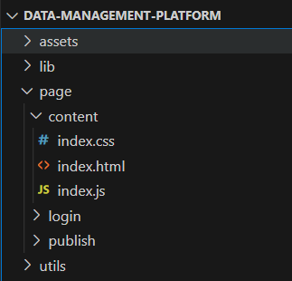
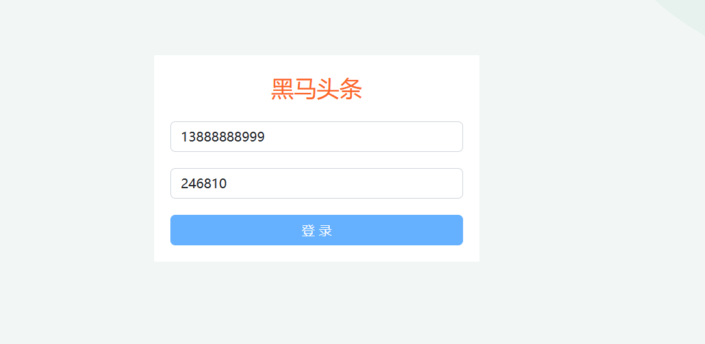
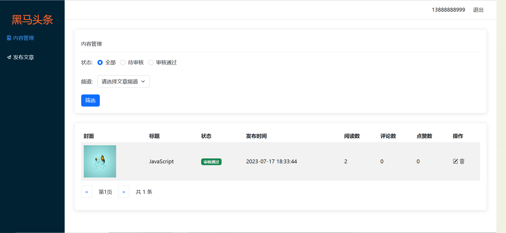
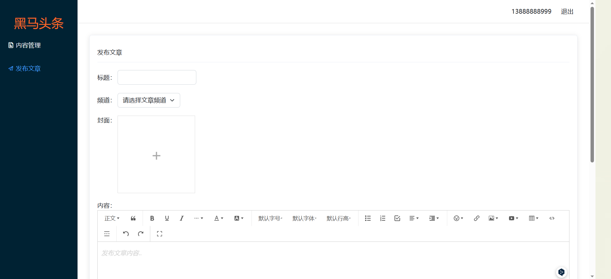

# data-management-platform
黑马头条-数据管理平台：对IT资讯移动网站的数据，进行数据管理

数据管理平台-演示：[黑马头条-数据管理平台 ](https://1941289645.github.io/data-management-platform/page/login/)

移动网站-演示(发布的文章可在此查看)：[http://](http://geek.itheima.net/)[geek.itheima.net](http://geek.itheima.net/)[/](http://geek.itheima.net/)

## 功能：

1.登录和权限判断

2.查看文章内容列表（筛选，分页）

3.编辑文章（数据回显）

4.删除文章

5.发布文章（图片上传，富文本编辑器）

## 技术：

基于 Bootstrap 搭建网站标签和样式

集成 wangEditor 插件实现富文本编辑器

使用原生 JS 完成增删改查等业务

基于 axios 与黑马头条线上接口交互

使用 axios 拦截器进行权限判断

## 项目准备：

准备配套的素材代码

包含：html，css，js，静态图片，第三方插件等

## 目录管理：

建议这样管理，方便查找

assets：资源文件夹（图片，字体等）

lib：资料文件夹（第三方插件，例如：form-serialize）

page：页面文件夹

utils：实用程序文件夹（工具插件）

## 项目展示：

**登录**：符合11位手机号，登录后在后台自动注册，密码默认246810。

**内容管理**：

**发布文章**：

